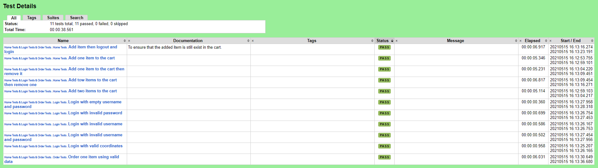
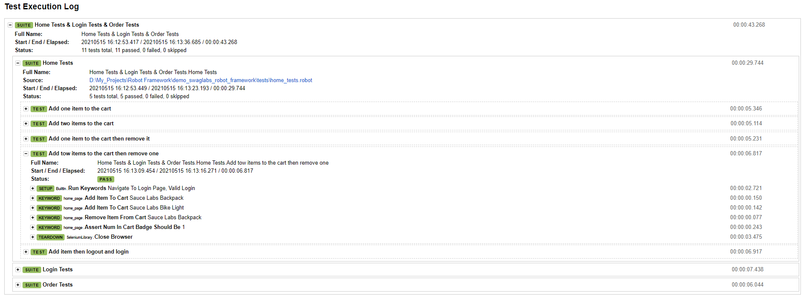
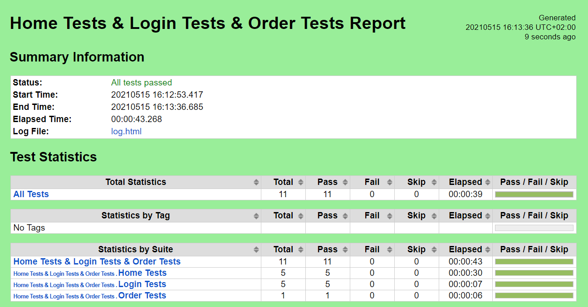

# Demo SWAGLABS Test Using Robot Framework

#### A simple project to test [SWAGLABS](https://www.saucedemo.com/) site using [Robot Framework](https://robotframework.org/).

### The used Plugins:
* [Selenium Library](https://robotframework.org/SeleniumLibrary/SeleniumLibrary.html)
* [String](https://robotframework.org/robotframework/latest/libraries/String.html)